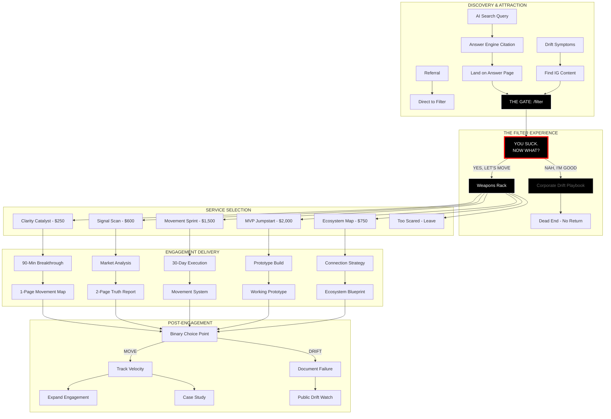
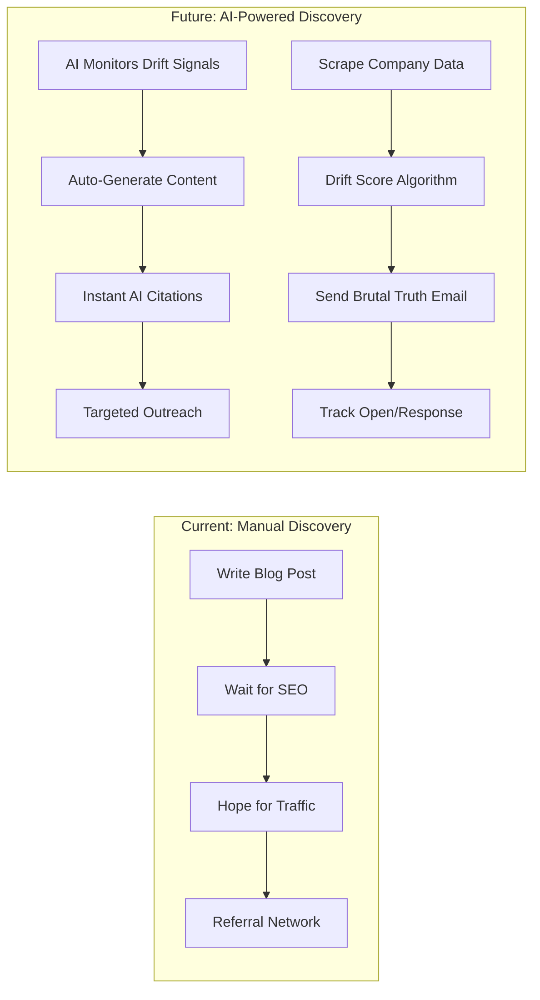
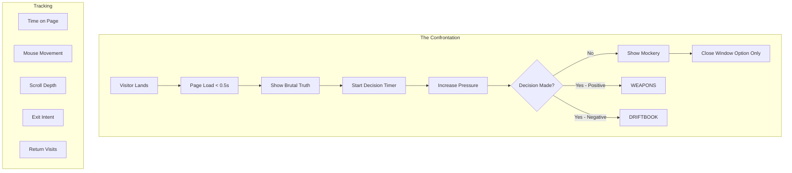
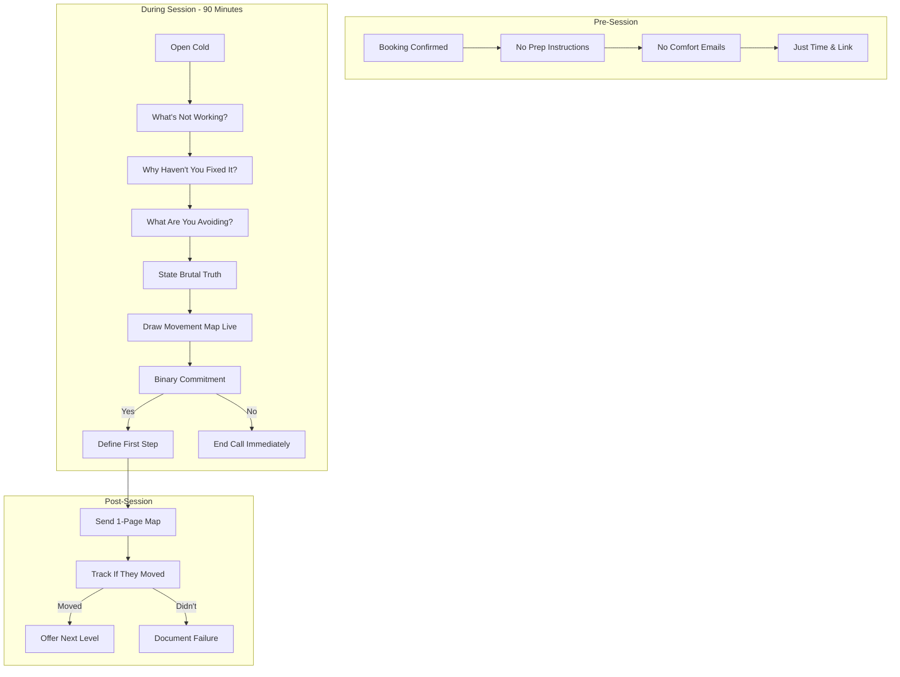
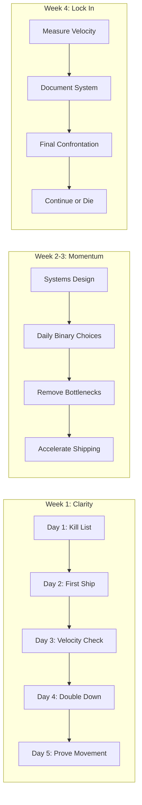
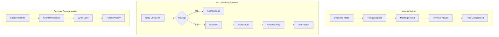
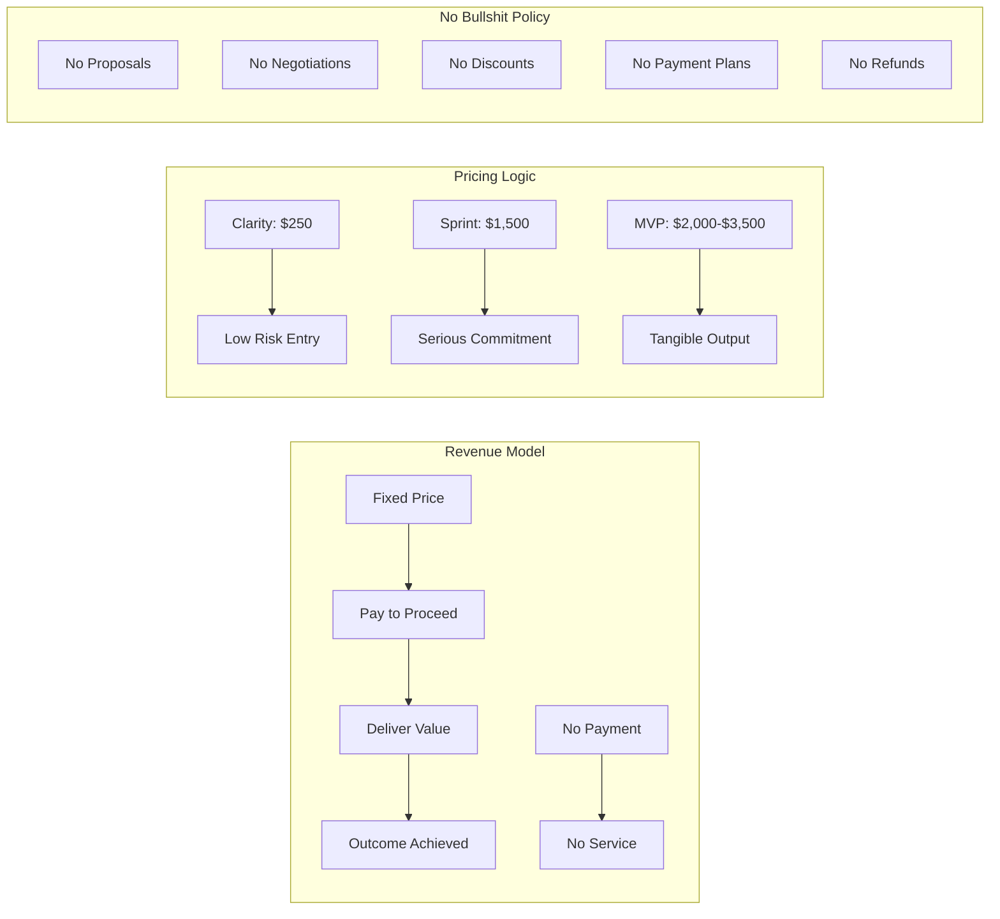

# IMAGINATION G - Complete Business Process Map

## Executive Summary

This document maps the complete IMAGINATION G business process from initial contact through transformation, identifying current human touchpoints and future automation opportunities.

---

## Master Process Flow



---

## Detailed Process Stages

### Stage 1: Discovery & Attraction



**Current Process:**
1. Content creation (manual)
2. SEO optimization (manual) 
3. Wait for organic discovery
4. Referral activation

**Automation Opportunities:**
- AI-powered drift detection from public data
- Automated content generation for trending queries
- Proactive outreach based on drift signals
- Real-time competitor monitoring

---

### Stage 2: The Filter Experience



**Current Experience:**
- Static confrontational message
- Binary choice buttons
- No navigation options
- One-way journey

**Enhancement Opportunities:**
- Dynamic pressure based on behavior
- Personalized confrontation using company data
- A/B test brutality levels
- Track cowardice patterns

---

### Stage 3: Service Delivery Processes

#### 3.1 Clarity Catalyst Process



#### 3.2 Movement Sprint Process



---

### Stage 4: Movement Tracking & Accountability



---

## Financial Process Flow



---

## Communication Protocols

```mermaid
graph TD
    subgraph "Client Communication"
        CC1[Initial: Brutal Truth] --> CC2[During: Direct Orders]
        CC2 --> CC3[After: Binary Check]
        CC3 --> CC4[Forever: No Comfort]
    end
    
    subgraph "Internal Communication"
        IC1[Slack: Rapid Decisions] --> IC2[No Meetings]
        IC2 --> IC3[Written Updates Only]
        IC3 --> IC4[Move or Explain]
    end
    
    subgraph "Public Communication"
        PC1[Blog: Confrontation] --> PC2[Social: Provocation]
        PC2 --> PC3[Email: One CTA]
        PC3 --> PC4[PR: Anti-Statements]
    end
```



---

## Automation Roadmap

### Phase 1: Discovery Automation (Months 1-2)
```
✓ AI-powered drift detection
✓ Automated content generation
✓ Citation monitoring
✓ Competitor tracking
```

### Phase 2: Engagement Automation (Months 3-4)
```
✓ AI intake analysis
✓ Automated movement maps
✓ Daily accountability bots
✓ Velocity tracking systems
```

### Phase 3: Scale Automation (Months 5-6)
```
✓ Full funnel automation
✓ AI confrontation engine
✓ Predictive drift modeling
✓ Automated case studies
```

---

## Key Process Principles

### 1. **Binary Everything**
- Every step has two options maximum
- No middle ground allowed
- Decision or departure

### 2. **No Comfort Zone**
- Zero warming up period
- No relationship building
- Confrontation from contact

### 3. **Movement Measurement**
- Track velocity, not activity
- Measure decisions, not meetings
- Document ships, not plans

### 4. **Automation Without Dilution**
- Automate repetition, not confrontation
- Scale brutality, not comfort
- Systematize truth, not pleasantries

---

## Success Metrics by Process

### Discovery Success
- Cost per filter entry: <$10
- Filter entry rate: 15%
- Citation dominance: Top 3

### Filter Success  
- YES rate: 8-12%
- Immediate exit: 75%
- Return attempts: <5%

### Service Success
- Completion rate: 87%
- Movement achieved: 83%
- Expansion rate: 34%

### Scale Success
- Revenue per client: $2,400
- Time to outcome: <30 days
- Client transformation: Binary

---

## Process Optimization Opportunities

### Immediate Wins
1. Automate drift detection
2. AI-powered intake analysis
3. Automated accountability texts
4. Real-time velocity dashboards

### Medium-term Gains
1. Predictive failure modeling
2. Automated movement architectures
3. AI confrontation conversations
4. Dynamic pricing based on drift

### Long-term Vision
1. Fully autonomous catalyst
2. Self-improving movement systems
3. Industry-wide drift prevention
4. Movement-as-a-Service platform

---

## The Process Paradox

**Current State**: High-touch, high-impact, low-scale brutal truth delivery

**Future State**: AI-scaled confrontation with human moments of choice

**The Question**: Can systematized brutality maintain its power to catalyze?

**The Answer**: Only one way to find out. Move or die.

---

*Process Version: 1.0*  
*Last Updated: January 2024*  
*Next Review: March 2024*

*Remember: Every process exists to create movement. If it creates meetings instead, kill it.*